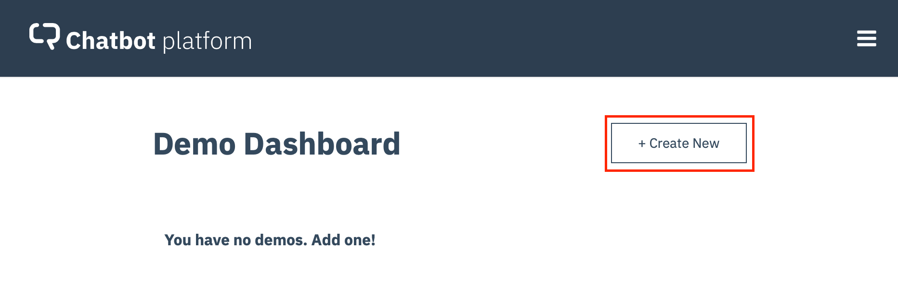

# _**Watson Assistant Lab 2**_: Chatbot Integrations
In this lab we'll build a web-hosted chat widget that will allow you to test the _**Watson Assistant**_ _skill_ you've just created in a web environment. We'll then finish by creating a live, publicly available web-hosted version of your chatbot.

## Requirements
- Successful completion of [Lab 1: Cognitive Chatbot Basics](../1-Basics).

## Agenda
- Create an _**Assistant**_ for your skill
- Create a _**Preview Link**_: a web widget to test your chatbot
- Setup a live web-hosted chatbot

## Create an _**Assistant**_ for your skill
An _**assistant**_ is the user-facing component of _**Watson Assistant**_ that manages the flow of information between your _skills_ and your users. _Assistants_ also allow you to create _**integrations**_ that publish your chatbot to the channels your customers will typically go to for help, e.g. _Slack_, _Facebook Messenger_, _Wordpress_, etc.

**(1)** Select `IBM Watson Assistant` from the very top left of the screen, then from the `Assistants` screen, hit `Create assistant`.

**(2)** Add a **Name** and **Description** for your _Assistant_, and select `Create assistant`.

**(3)** From here Select `Add Dialog Skill` and select your `Phone Advisor` skill.

**(4)** Your _Assistant_ should now look like this:

## Create a _**Preview Link**_: a web widget to test your chatbot
The first _integration_ we'll create for our chatbot is a _**Preview Link**_. Actually, when you create an _assistant_, a test web site is provisioned for you _automatically_. It has a simple chat widget interface that you can use to interact with your chatbot for testing purposes. You can also share the URL to this IBM-branded site with your team members.

**(1)** Select the `Preview Link` that has already been created from `Integrations`:

**(2)** You can change the **Name** and **Description** of the _Preview Link_ if you like. For now though, just click the URL under **Try it out and share the link**.

**(3)** You'll then be taken to a web page where your chatbot is hosted within a widget:

**(4)** That's it! You have a shareable web-based chatbot you can use to externally test your _skill_. Try some of the _dialog_ you've already created - you'll see that the widget handles both the text and image responses automatically.

## Setup a live web-hosted chatbot
As well as using _**Watson Assistant**_ _integrations_, you can build your own application that uses the chatbot logic you've created. This typically does require some web or mobile development skills. Fortunately, the _IBM iLab team_ has created a _**Chatbot Platform**_ application, that can create a live, customisable, publicly-available web-based chatbot for you, without the need for these skills.

**(1)** Launch the _Chatbot Platform_ from [here](http://chatbot-platform.eu-gb.mybluemix.net), and register for access. Once you've successfully registered, you will be taken to the Demo Dashboard.

**(2)** Hit `Create New` and select `Empty demo`:

Now enter a name for your chatbot (e.g. `Phone Advisor`) and hit `Create`.

**(3)** From here we can link to our _**Watson Assistant**_ _skill_, and customise the look and feel of the web interface to our chatbot that we are about to create.

Start by editing the **Chatbot header** and **Chatbot subheader** fields. This is the text that will appear on the webpage as the title(s) of your chatbot. You can also use the **Choose colorscheme** dropdown menu here to change the basic look of your webpage.

**(4)** Next you'll need security credentials from _**Watson Assistant**_ in order to connect your chatbot skill to the web application that will be generated for you.

From the `Manage` screen within your _**Watson Assistant**_ service in _**IBM Cloud**_, you will need the `URL` and the `API key`. You can copy the API Key by selecting the `Copy to Clipboard!` icon.

In the _Chatbot Platform_:
- select `Watson Assistant` from the sidebar
- copy the URL (1) from your _**Watson Assistant**_ credentials in IBM Cloud, and paste it to the `Url` field
- copy the `API Key` (2) from your _**Watson Assistant**_ credentials into the `Apikey` field

Now hit `Save`.

**(5)** At this point the _Chatbot Platform_ application connects to _**Watson Assistant**_ and display a list of the _skills_ you've created, in a pulldown menu under **Workspace name**. If you had created multiple skills you would select the one you want to use here. As we've only created one so far, it's automatically selected:

**(6)** Finally, click the `Sharing & Security` menu option. Here you'll see a live link to your web chatbot. If you want a customised link then add some text here - it will be appended to the link URL. Also here, you can enter and save a password that will be used to login to your chatbot app.

**(7)** Now click the URL link, enter the password you've set, and you'll see your web-based chatbot! Test it out with your existing _dialog_ as before.

## Summary
Well done! You've now built a basic chatbot that uses three user interfaces!

Next you should go to [Lab 3: Understanding User Sentiment - Integrating Watson Natural Language Understanding](../3-Sentiment) to further build out and enhance your chatbot by using more _**Watson Assistant**_ functionality.
