# _**Watson Assistant Lab 2**_: Chatbot Integrations
In this lab we'll build a web-hosted chat widget that will allow you to test the _**Watson Assistant**_ _skill_ you've just created in a web environment. We'll then finish by creating a live, publicly available web-hosted version of your chatbot.

## Requirements
- Successful completion of [Lab 1: Cognitive Chatbot Basics](../1-Basics).

## Agenda
- Create an _**Assistant**_ for your skill
- Create a _**Preview Link**_: a web widget to test your chatbot

## Create an _**Assistant**_ for your skill
An _**assistant**_ is the user-facing component of _**Watson Assistant**_ that manages the flow of information between your _skills_ and your users. _Assistants_ also allow you to create _**integrations**_ that publish your chatbot to the channels your customers will typically go to for help, e.g. _Slack_, _Facebook Messenger_, _Wordpress_, etc.

**(1)** Select `IBM Watson Assistant` from the very top left of the screen, then hit `Create assistant`.

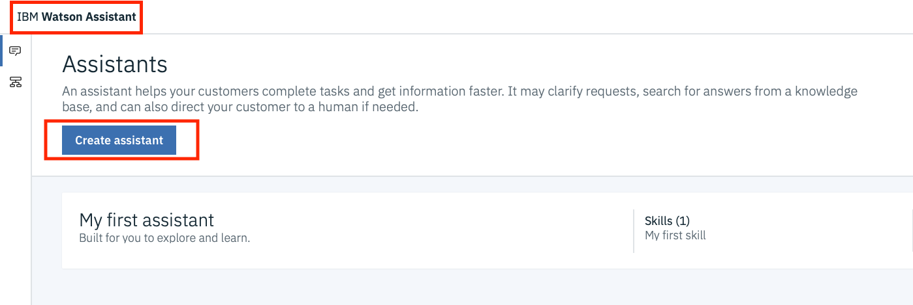

**(2)** Add a **Name** and **Description** for your _Assistant_, and select `Create assistant`.

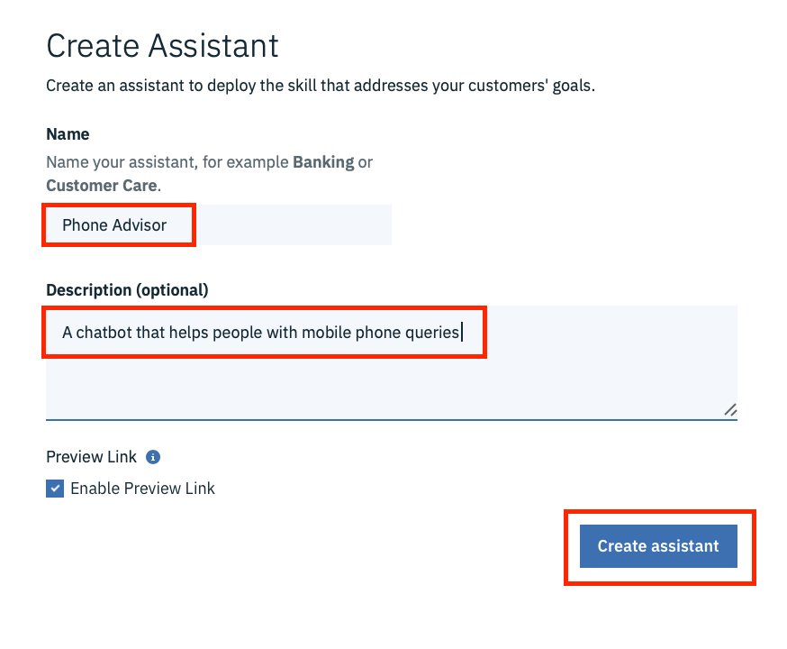

**(3)** From here Select `Add Dialog Skill` and select your `Phone Advisor` skill.

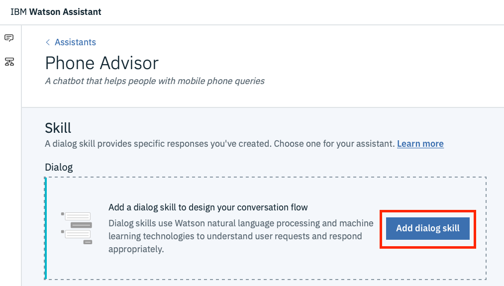

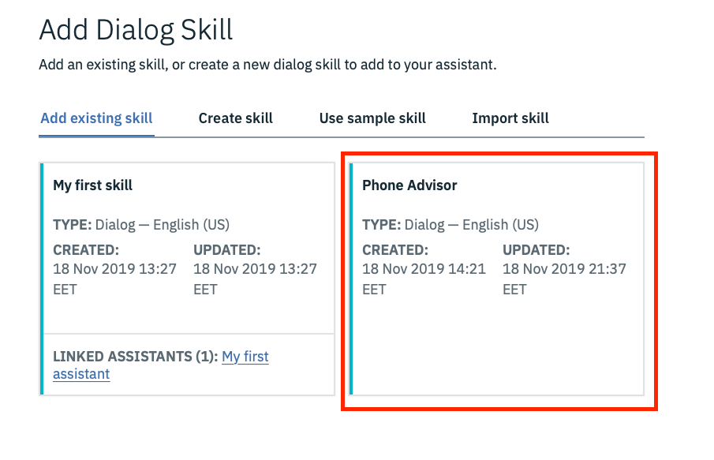

**(4)** Your _Assistant_ should now look like this:

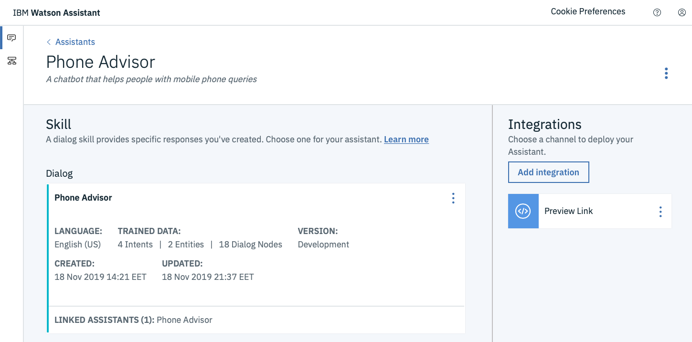

## Create a _**Preview Link**_: a web widget to test your chatbot
The first _integration_ we'll create for our chatbot is a _**Preview Link**_. Actually, when you create an _assistant_, a test web site is provisioned for you _automatically_. It has a simple chat widget interface that you can use to interact with your chatbot for testing purposes. You can also share the URL to this IBM-branded site with your team members.

**(1)** Select the `Preview Link` that has already been created from `Integrations`:

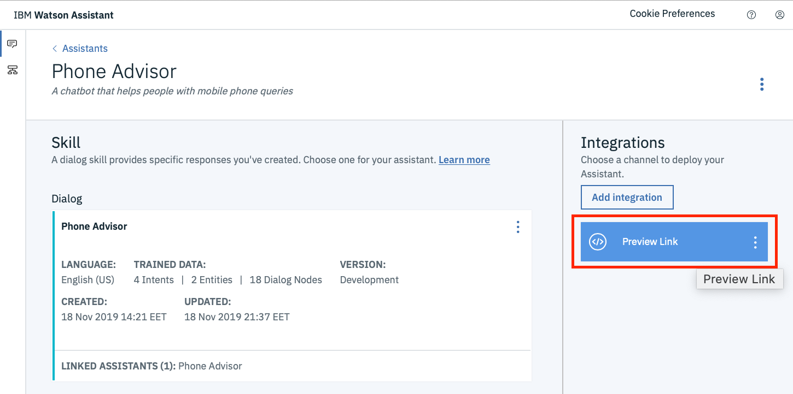

**(2)** You can change the **Name** and **Description** of the _Preview Link_ if you like. For now though, just click the URL under **Try it out and share the link**.

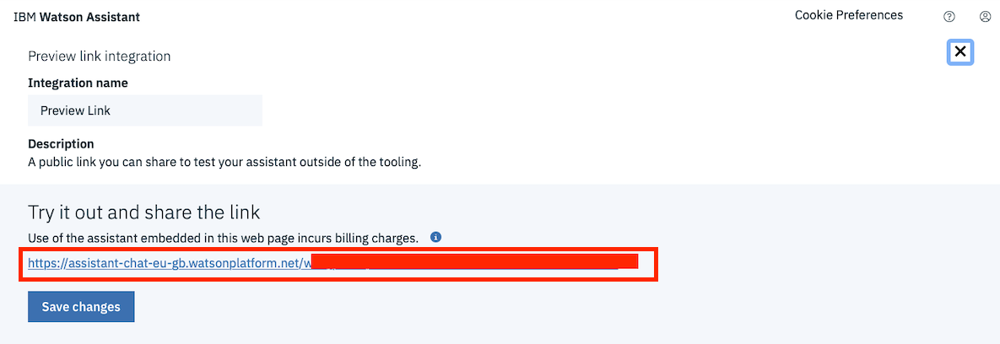

**(3)** You'll then be taken to a web page where your chatbot is hosted within a widget:

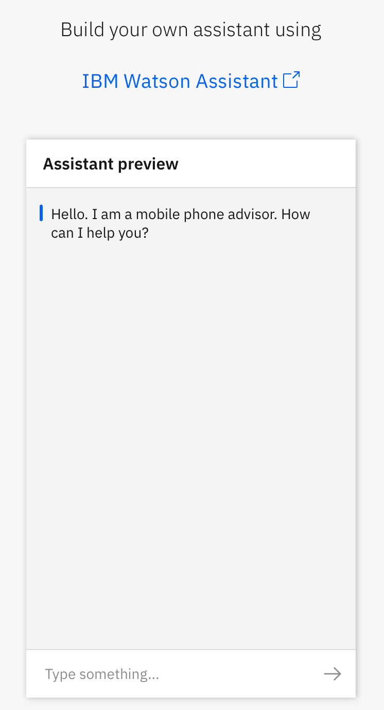

**(4)** That's it! You have a shareable web-based chatbot you can use to externally test your _skill_. Try some of the _dialog_ you've already created - you'll see that the widget handles both the text and image responses automatically.

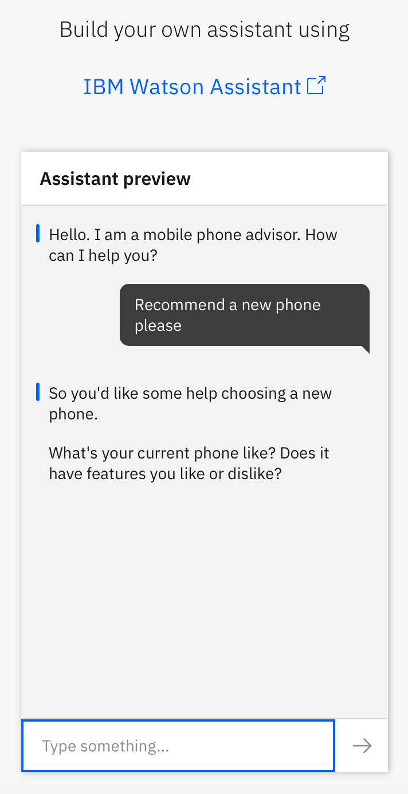
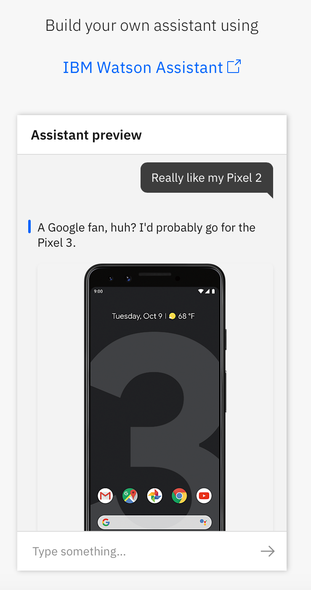
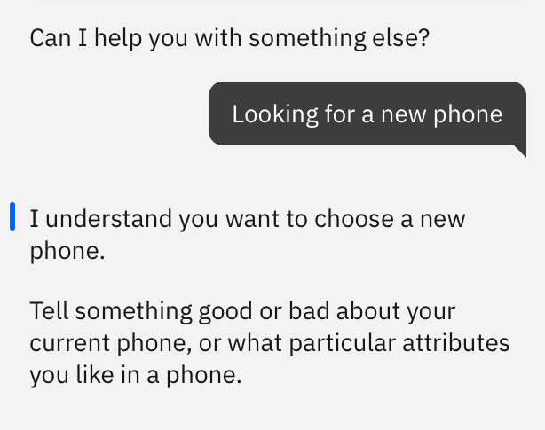
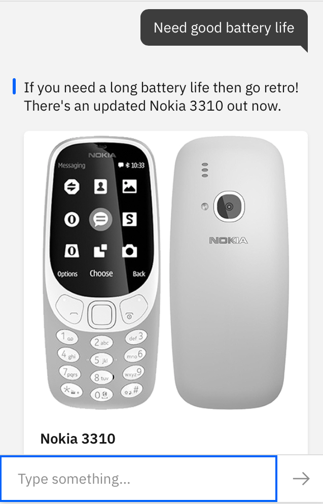

## Summary
Well done! You've now built a basic chatbot that uses user interface!

Next you should go to [Lab 3: Understanding User Sentiment - Integrating Watson Natural Language Understanding](../3-Integrations-Sentiment) to further build out and enhance your chatbot by using more _**Watson Assistant**_ functionality.
